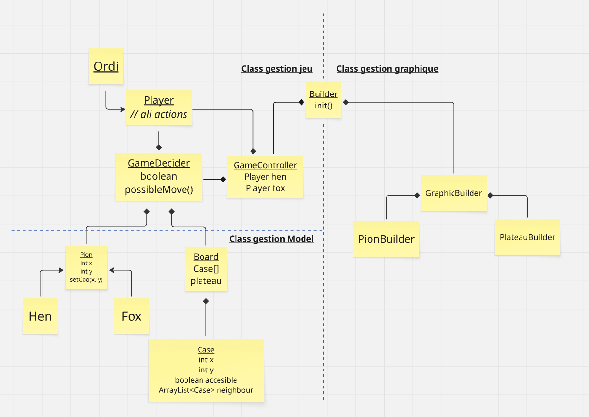

# Chicken-Fox

## Participants :
	- BRONNER Mattéo
	- COLOMBAIN Lili
	- HEBIE Tié Rachida
	- MAHAMANE Mansourah
	- RUICHEK Ibtisseme

## Livrables : (Jalon 1)

 1. Présenter 2 stratégies du joueur ordinateur
	-> description + évaluation des performances + évaluation de l'efficacité
2. Vidéo 5min
	-> présentation de la façon de jouer du mode texte (tuto)
 3. Programmation en mode texte 

## UML

